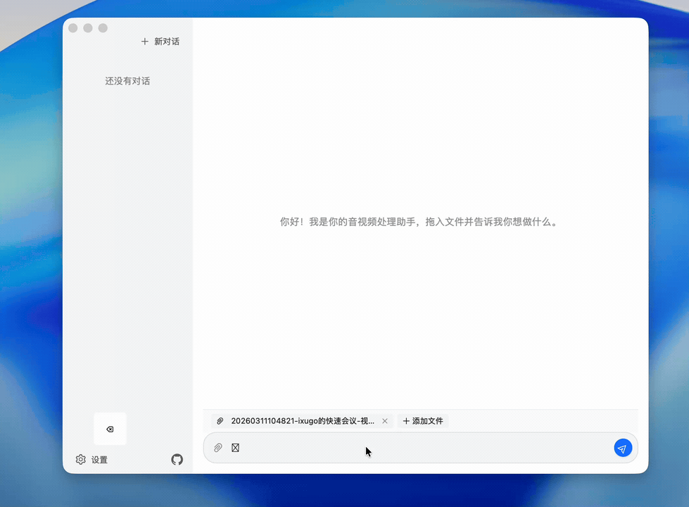

<p align="center">
  
</p>

<h1 align="center">FFAgent</h1>

<p align="center">
  AI-powered audio/video processing desktop app. Chat to operate — drop files, describe what you need, and let AI handle the rest.
</p>

<p align="center">
  <a href="https://github.com/ixugo/ffagent/releases">Download</a> · <a href="#quick-start">Quick Start</a> · <a href="#features">Features</a> · <a href="./README.md">中文</a>
</p>

---

## Demo

<p align="center">
  
</p>

## Features

- **Drag & Drop** — Drop files directly into the chat window, or click the attachment button to select files
- **Natural Language Driven** — Describe your needs in plain language, no FFmpeg syntax required
- **Auto Error Correction** — AI analyzes execution errors and automatically retries with corrected commands, up to 7 rounds
- **Real-time Feedback** — Shows commands and output during execution, with collapsible details
- **One-click Open** — Click to open the output file directory after processing
- **Multi-language** — Switch between Chinese/English interface, AI responses follow the language setting
- **Compatible with Multiple AI Services** — Supports OpenAI, LM Studio, Ollama and other compatible APIs

## Quick Start

1. Download the installer for your platform from [Releases](https://github.com/ixugo/ffagent/releases)
2. Install and open FFAgent
3. Configure the AI service URL and API Key in Settings (Menu > Settings or `Cmd+,`)
4. Drag in a video file, type what you want to do, and press Enter

## How It Works

FFAgent wraps FFmpeg's powerful capabilities behind a chat interface. You don't need to remember any FFmpeg parameters or commands — just describe what you want in natural language: transcode, trim, extract audio, adjust resolution, merge videos. It automatically generates and executes the correct commands. If execution fails, the AI autonomously analyzes the cause and retries, with up to 7 rounds of automatic error correction until the task is complete.

## Supported Platforms

| Platform | Architecture | Format |
|----------|-------------|--------|
| macOS | Apple Silicon (arm64) | `.dmg` |
| Windows | x64 | `.exe` |
| Linux | x64 | `.AppImage` |

## Configuration

Available settings in the Settings page:

| Setting | Description |
|---------|-------------|
| **API URL** | Default `http://127.0.0.1:1234/v1`, compatible with LM Studio local deployment |
| **API Key** | Your AI service key |
| **Model** | The model identifier to use |
| **Language** | Chinese / English |

## Tech Stack

- **Frontend** — React + TypeScript + Ant Design X
- **Desktop Shell** — Tauri 2
- **Core Agent** — Go

## Development

### Prerequisites

- Node.js 22+
- Go 1.24+
- Rust (stable)
- macOS: Xcode Command Line Tools
- Linux: `libwebkit2gtk-4.1-dev libappindicator3-dev librsvg2-dev patchelf`

### Start Development Mode

```bash
npm install
make dev
```

### Build

```bash
make build/darwin-arm64    # macOS arm64
make build/windows-amd64   # Windows x64
make build/linux-amd64     # Linux x64
```

## FFmpeg Binaries

Download the FFmpeg/FFprobe binaries for your platform from [FFmpeg Builds](https://github.com/btbn/ffmpeg-builds/releases) and place them in the corresponding subdirectory under `vendor/ffmpeg/`.

## License

[MIT](LICENSE)
